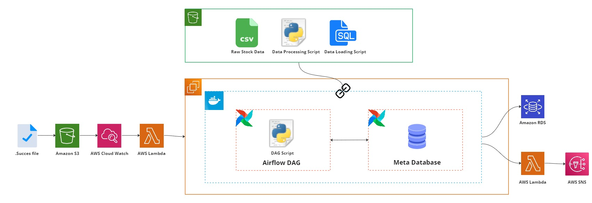
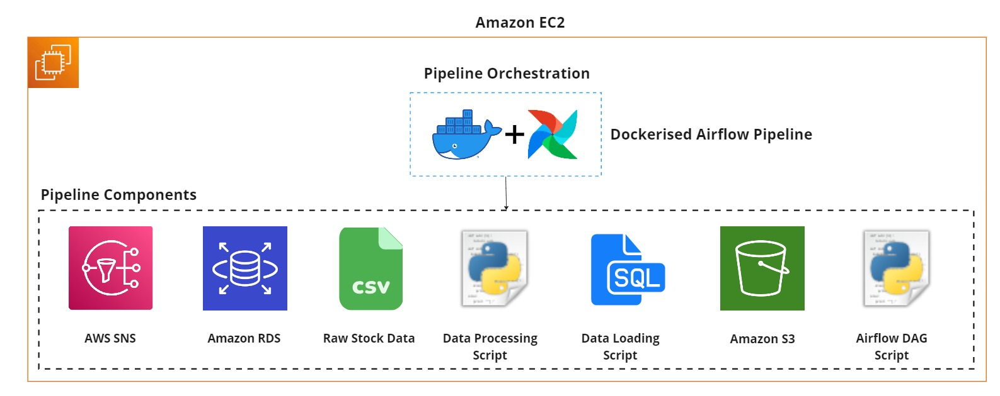
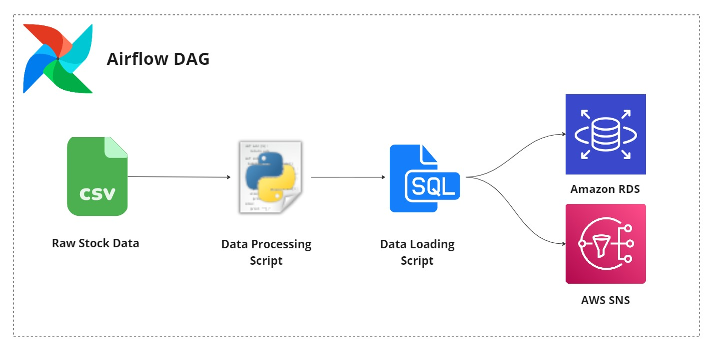

# Data Engineering – Moving Big Data  
© Explore Data Science Academy

## Predict instructions


#### Table of contents 

- [Data Engineering – Moving Big Data](#data-engineering--moving-big-data)
  - [Predict instructions](#predict-instructions)
      - [Table of contents](#table-of-contents)
  - [Predict overview](#predict-overview)
    - [Functional requirements of the data pipeline](#functional-requirements-of-the-data-pipeline)
    - [Using these instructions](#using-these-instructions)
  - [Part-I: Configure pipeline layers](#part-i-configure-pipeline-layers)
    - [Component overview](#component-overview)
    - [Pipeline layers](#pipeline-layers)
      - [Security](#security)
      - [Data source](#data-source)
      - [Data storage](#data-storage)
    - [Create an event-based lambda](#create-an-event-based-lambda)
  - [Part-IV: Data pipelines MCQ](#part-iv-data-pipelines-mcq)
  - [Part-V: Post-predict clean-up](#part-v-post-predict-clean-up)

## Predict overview
[Back to top](#table-of-contents)

<p align='center'>
     
     <br>
     <em>Figure 1: A representation of the completed pipeline that you will need to implement within this predict.</em>
</p>

Data plays an extremely important role in the study of publicly listed companies and stock market analyses. You're part of a small team tasked with migrating an on-premise application to the AWS cloud. This application shows valuable information about the share prices of thousands of companies to a group of professional stock market traders. The data is further used by data scientists to gain insights into the performance of various companies and predict share price changes that are fed back to the stock market traders.

As part of this migration, raw data, given in the form of company `csv` snapshot batches gathered by the on-premise application, needs to be moved to the AWS cloud. As an initial effort in this movement of data, the stock traders have homed in on the trading data of 1000 companies over the past ten years, and will only require a subset of the raw data to be migrated to the cloud in a batch-wise manner.  

With the above requirements, your role as a data engineer is to create a robust data pipeline that can extract, transform and load the `csv` data from the source data system to a SQL-based database within AWS. The final pipeline (represented in Figure 1) needs to be built in [Airflow](https://airflow.apache.org/) and should utilise AWS services as its functional components. 

### Functional requirements of the data pipeline
[Back to top](#table-of-contents)

At its completion, your formed data pipeline should exhibit the following functionality: 

 - **Pipeline input:** The pipeline should be capable of *ingesting and processing up to 1000 small (<1Mb) `csv` files* per workflow run.
 - **Pipeline output:** The resulting processed data should be *stored within a single PostgreSQL DB table* hosted on AWS.   
 - **Monitoring:** The pipeline should provide an *email-based success or failure notification* following an attempted run.  
 - **Automation:** The pipeline should be *event-driven*, triggering upon a file change in a monitored Amazon S3 bucket. The pipeline will not be invoked more than once per day. 
 - **Scaling:** There are no scaling requirements for the pipeline, and there is no need to make assumptions about concurrent runs or the size of the input batch increasing. 

### Using these instructions
[Back to top](#table-of-contents)

This guide is provided as a means to help you in the planning and implementation of your Moving Big Data Predict project.

In the following sections, we provide a general structure to the process of creating your containerised airflow data pipeline. Each section gives specifications for important components and actions involved in the development of the pipeline. Note that many implementation details are left to your discretion, and you will need to use both existing knowledge and personal research to complete this work.       

As a companion to these instructions, the following call-outs are used within the steps presented in this guide:    

> ℹ️ &nbsp;**IMPORTANT  INSTRUCTIONS** &nbsp; ℹ️ 
> 
> This call-out provides important guidance to take note of while implementing a step or considering a section within the predict.  

> 📝 &nbsp; **MARKING COMPONENT**  &nbsp; 📝
> 
> This call-out is placed around steps used to produce deliverables for marking. Adhere to these steps carefully and comply with instructions.   

> 🧑‍🏫 &nbsp; **POTENTIAL PITFALL** &nbsp; 🧑‍🏫
> 
> This call-out is present within steps that may be particularly difficult to complete.

> 💸 &nbsp; **COST TRAP** &nbsp; 💸 
> 
> This call-out is used to indicate steps and actions within AWS that could potentially be expensive if not done correctly. Extreme diligence should be exercised around these sections.   


## Part-I: Configure pipeline layers 
[Back to top](#table-of-contents)

As we learned in the *Moving Big Data* digital skill, a data pipeline consists of numerous tasks, each performing work modularly. Each of these tasks can be classified as belonging to a specific concern or *layer* within the pipeline. Furthermore, each task has underlying AWS services and components that it relies on.  

In this section, you'll be required to implement the various components and layers needed to run a data pipeline. 

### Component overview
[Back to top](#table-of-contents)

<p align='center'>
     
     <br>
     <em>Figure 2: The individual components utilised within the formed data pipeline.</em>
</p>

*Table 1* below describes the components used to form the data pipeline. These components are also displayed for convenience in *Figure 2*. 

**Table 1: Data pipeline components**

| Component name | Description |
| :------------  | :---------- | 
| Raw stock data | Provided as `.csv` files, this data contains stock market movement data for over 1000 companies listed on the US stock market. This data will be extracted, processed, and loaded into a relational database as part of the formed data pipeline within the predict. | 
| Amazon S3      | Stores the stock market data in different forms (raw and processed) during pipeline execution.  |
| Amazon EC2     | A `t2.medium` instance, housing the dockerised airflow pipeline and providing the compute necessary for data processing within the data pipeline.  | 
| Processing script | A Python file describing the processing operations to be performed on the data. |
| DAG Script| A python file describing the airflow pipeline that is to be executed|
| Amazon RDS | A `db.t2.micro` PostgreSQL database used as the target data system for the processed data within the pipeline. | 
| Data loading script | A SQL file containing queries to insert the processed data into the RDS instance, and its subsequent updating once inserted. | 
| AWS SNS | Produces a notification (via email) of the pipeline's run status (success or fail)|
 

### Pipeline layers
[Back to top](#table-of-contents)

<p align='center'>
     
     <br>
     <em>Figure 3: Data pipeline layers that will eventually interact with one another.</em>
</p>

In the following steps, we provide implementation details for each component of the pipeline. These components are grouped, respectively, under the pipeline layers that they are associated with.

> ℹ️ &nbsp;**GENERAL NAMING CONVENTION** &nbsp; ℹ️ 
> 
> Throughout this predict, unless directly stated, there is no enforced naming convention for AWS services created. However, as a means to keep your working environment organised, you may want to adopt a naming convention such as de-mbd-predict-{service name}. We use this convention throughout the model's solution implementation.  

#### Security
As the first step towards building the data pipeline, you are required to set up the necessary security and access permissions. You will need to configure the following: 
 - **Security groups**: You need to create a security group that will give you access to the AWS services and allows communication between the pipeline’s various services and components. Use the below **inbound** and **outbound** rules to control network traffic.
     
     - **Inbound rules**: Permit all traffic from the security group, in addition to your IP address, to have access to the RDS instance running on port `5432`. Additionally, permit `ssh` connections from your IP address.

     <br>

   | Type | Protocol | Port Range | Source | 
   | ---- | -------- | ---------- | ------ |
   | PostgreSQL | TCP | 5432 | All IPv4  | 
   | PostgreSQL | TCP | 5432 | \<Newly created security group\>  | 
   | All Traffic| All | All | All IPv4 | 

   > For security reasons, the All IPv4 source for the first PostgreSQL rule should be changed to My IP once testing is done.  
   <br>

    - **Outbound rules:** Permit all outbound traffic. 

    <br>
  
   | Type | Protocol | Port Range | Destination | 
   | ---- | -------- | ---------- | ------ |
   | All TCP | TCP | 0 - 65535 | "Anywhere - IPv4. 0.0.0.0/0"  | 
   | All TCP | TCP | 0 - 65535 | "Anywhere - IPv6. ::/0"  | 


 - **IAM role policies**
 The data pipeline will need to perform multiple actions using different AWS services.
   - Create a new IAM role for an EC2 instance to include the policies and trust relationships below: 
      
      | Policies | Trust Relationships |
      | -------- | ------------------- |
      | AmazonSNSFullAccess | rds.amazonaws.com|
      | AmazonRDSDataFullAccess    | ec2.amazonaws.com|
      | AmazonS3FullAccess         | |


#### Data source 
The stock data required for the predict is currently located in Google Drive. You will need to download it to your local machine so that you can upload it to your S3 bucket later on.


1. Download the company stock dataset which can be found [here](https://drive.google.com/file/d/1sALlvt3T_77L93cLBqdwqgmoivzWWeOO/view?usp=sharing). 

2. Unzip the file contents into a folder. Ensure that there are 7192 `.csv` files extracted. 


 
#### Data storage 

When creating the data pipeline, you will need to store multiple artefacts for different purposes, such as the source data on stocks, scripts that govern the data transformation and movement, logs created by your pipeline, and the output produced.

 - **Configure the source S3 bucket**
   > ℹ️ &nbsp;**S3 NAMING CONVENTION** &nbsp; ℹ️ 
   > 
   > Use the following naming convention when creating your S3 bucket within this step: "de-mbd-predict-{firstname}-{lastname}-s3-source". For example, if you were named Dora Explorer, your configured name would be "de-mbd-predict-dora-explorer-s3-source". 

   1. Create an S3 bucket that will be used for the pipeline to store source data, processing scripts, and log files.
   2. To accommodate various pipeline elements, create the following folder structure in your S3 bucket:

   <br>

   ```
    ├── CompanyNames
    ├── Output
    ├── Scripts
    └── Stocks
    ```

   3. Upload the downloaded `.csv` files to the `Stocks/` folder. Note that this upload may take some time due to the number of files involved in the process. Consider using the AWS CLI to achieve this task.    

   4. Upload the  [`top_companies.txt`](data/top_companies.txt)file into the `CompanyNames/` folder.

 - **Configure RDS instance:**

   After processing the data from the S3 bucket, the resulting data will need to be stored in a database. For this use case, you will need to make use of the Amazon RDS service. Configure a `PostgreSQL` RDS instance in AWS for this purpose. The RDS instance should have the following properties: 

     | RDS Instance Property | Value | 
    | :-------------------- | :---- | 
    | Creation method       | Standard | 
    | Engine type           | PostgreSQL |
    | Version               | 14.6-R1 |
    | Instance Size         | db.t3.micro |
    | Template              | Free tier | 
    | Allocated Storage     | 20GB |
    | Storage autoscaling   | Disabled |
    | VPC                   | Default |  
    | Security Group        | \<Newly created security group\> |  
    | Public access | Yes | 

#### Resources
 - **Configure Amazon EC2 instance**

   Many of the components within the data pipeline require a host compute instance to execute. For this step, you need to provision an EC2 instance and configure it to run the data processing tasks. 
   
   1. Use the following properties to create the compute instance, leaving any unspecified property in its default state:

   <br>

    | EC2 Instance Property | Value | 
    | :-------------------- | :---- | 
    | AMI       | edsa-airflow-ami | 
    | AMI  ID     | ami-05f67f34b041e3b67 | 
    | Instance type           | `t2.medium` |
    | VPC                   | default |  
    | Storage                   | 30GB SSD Volume |  
    | Tag-based name     | ex. "Name: de-mbd-predict-EC2" | 
    | Security Group        | \<Newly created security group\> |  
    | Security key | ex. "ec2-de-mbd-predict-key" |

   2. Ensure that you save the resulting security key `.pem` file (ex. `ec2-de-mbd-predict-key.pem`) in a secure location. 

   3. Connect to your remote instance via `SSH`, update the instance as prompted, then proceed to download and install the following dependencies:
      
         1. **Anaconda**  to have a Python environment;

         2. **Pandas** to perform the required data manipulation; and

         3. **Latest version of the AWS Command Line Interface (CLI)** so that you can interact with AWS services on your EC2 instance. Don't forget to configure your AWS credentials.
   4. Since you will complete the predict over a few weeks, you may find it useful to set a static IP for your EC2 instance. Otherwise you will have to continously obtain the new IP address that is allocated to your EC2 instance.
            


   > 🧑‍🏫 &nbsp; **KEEPING CREDENTIALS SECURE** &nbsp; 🧑‍🏫
   > 
   > Keep your AWS credentials secure at all times. No other student or individual should be allowed access to your EC2 instance, either by altering the security group permissions or by making your AMI publicly accessible to other AWS accounts. 

 - **Mount S3 data source**

   To gain access to the source data and associated processing scripts used within the pipeline, the configured EC2 instance needs to be able to mount the S3 bucket initialised in the previous steps.

   1. Make use of the **S3FS Fuse** filesystem application to mount the source S3 bucket to your EC2 instance.
   2. Once you have set up s3fs fuse, the below command can be used to assist in mounting your S3 Bucket. THe command assumes that the directory where the S3 bucket will be mounted is called 's3-drive'

        ```bash
       s3fs -o iam_role=<your-ec2-role> -o url="https://s3.eu-west-1.amazonaws.com" -o endpoint=eu-west-1 -o allow_other -o curldbg <bucket-name> ~/s3-drive
       ```

#### Data activities
 - **Process source data with Python**

   You now need to configure the pipeline components responsible for data processing and movement. 


   The first of these *data activities* is the gathering of specified company data into a single `.csv` file that will be loaded into our target RDS instance. Multiple actions are involved in this processing, which we outline below: 

   > 📝 &nbsp; **STUDENT DATA PROCESSING INSTRUCTIONS**  &nbsp; 📝
   > 
   > You are required to implement data transformations based on the provided notebook that gives a framework for the transformations needed.

   1. Convert the starter notebook, found [here](code/python_data_processing_walkthrough.ipynb) into a `.py` file that can execute within a bash script. Make sure you upload this Python script into the `Scripts/` folder.

   2. Copy the implemented Python script to your local machine, along with the `Stocks/` data folder if you haven't already.

   3. Use the local data and script to ensure that the processing is executing as expected. The output of the processing script should be a single `.csv` file (`historical_stock_data.csv`) containing the data of companies listed within the `top_companies.txt` file.

   4. Following the local testing, create a bash script to both mount the S3 bucket and invoke the data processing performed within this current step. This script should be uploaded into the `Scripts/` folder of the S3 bucket, so consideration should be taken to set the correct path when calling the data processing Python script within this bash file. 

   5. Now that all the items are uploaded to the cloud, retest the Python processing script on the remote EC2 instance. Ensure that it produces the same output `.csv` file within the mounted S3 bucket, in the `Output/` folder.


 - **Create database tables**

   With the data processing activity configured, you can now perform data loading – moving the processed data from our mounted S3 bucket to the target RDS instance.

   1. Download and install [pgAdmin](https://www.pgadmin.org/download/) for your operating system. As of writing, the latest stable release is pgAdmin4 (version 5.5).

   2. Connect to your RDS instance using pgAdmin.

   3. Create a new `historical_stocks_data` table within the database with the following fields, types, and properties: 

    | Field | Type | Properties | 
    | ----- | ---- | -------- |
    | stock_date | VARCHAR | Length (56), NULLABLE |
    | open_value | VARCHAR | Length (56), NULLABLE |
    | high_value | VARCHAR | Length (56), NULLABLE |
    | low_value | VARCHAR | Length (56), NULLABLE |
    | close_value | VARCHAR | Length (56), NULLABLE |
    | volume_traded | VARCHAR | Length (56), NULLABLE |
    | daily_percent_change | VARCHAR | Length (56), NULLABLE |
    | value_change | VARCHAR | Length (56), NULLABLE |
    | company_name | VARCHAR | Length (56), NULLABLE |

   4. With the RDS database populated with the requisite table, you now need to create a SQL insertion query to populate the table whenever data is processed as part of a data pipeline run. Save your query inside a file called `insert_query.sql` and upload it to `Scripts/` in the S3 bucket.

#### Data communication
   An important aspect of any pipeline is its observability. To enable the monitoring of the data pipeline, you are required to create a notification to produce alerts when the pipeline runs – resulting in either a success or failure notification. These notifications will be communicated via email.

   > 📝 &nbsp; **TOPIC NAMING CONVENTION**  &nbsp; 📝
   > 
   > The topic name configured in SNS is utilised during the automated testing of the predict. As such, the following topic naming convention should be used: *"de-mbd-predict-{First-name}-{Surname}-SNS"*. For example, with the name Dora Explorer, the topic would be named "de-mbd-predict-dora-explorer-SNS".
 
 - **Set up Amazon SNS pipeline monitoring alert**

1. Create a **topic** and **subscription** for the pipeline notification.
   - You may create two subscriptions for your notifications:
      - The first can be your personal email, which you can use when debugging your pipeline.
      - The second should be the edsa.predicts@explore-ai.net endpoint so that your predict can be marked.

   <br>

   > 📝 &nbsp; **SNS PREDICT EMAIL ENDPOINT**  &nbsp; 📝
   >
   > As in previous DE predicts, you will need to ensure that your generated email notifications are being sent to the `edsa.predicts@explore-ai.net` email address.  

## Part-II: Pipeline assembly 
[Back to top](#table-of-contents)

At this point, all the pipeline components and layers required to build your data pipeline should be ready. However, this is only half of the job done. You still need to utilise the individual components to create a containerised Airflow pipeline.

<p align='center'>
     
     <br>
     <em>Figure 4: The pipeline design utilising all previously configured layers.</em>
</p>


### Building the pipeline using airflow
[Back to top](#table-of-contents)

Make use of Docker and Airflow to achieve the architecture illustrated in *Figure 4*. There are no restrictions on how to proceed. Build the data pipeline using the functionality available to you via AWS Airflow. 


> 📝 &nbsp; **SNS SUBJECT LINE**  &nbsp; 📝
> 
> As the failure and success email subject lines are used in the marking of the predict, please make sure that you adhere to the following naming convention: FirstName_Surname_Pipeline_Failure and FirstName_Surname_Pipeline_Success. 


### Pipeline monitoring 
[Back to top](#table-of-contents)

Once you've created the pipeline, save and manually activate the pipeline. To ensure that the pipeline had executed successfully, you can perform two simple diagnostic actions.

1. Navigate to the debugging endpoint email address (your personal email) and ensure that a "Pipeline success" message has been sent to your inbox. If this message has not arrived, it may take an additional five minutes before the notification is sent by AWS. If a success signal is not received, hopefully, a "Pipeline failure" message is delivered instead.

2. You can check whether your pipeline is successful by doing the following: 
   1. Open your Airflow GUI and view your taks logs to assess the completion of your data pipeline.
   2. Use the pgAdmin client to log in to the RDS database and inspect your database table. If the pipeline run was successful, the table should contain the extracted company data produced during the data processing activity.


## Part-III: Pipeline automation  
[Back to top](#table-of-contents)

<p align='center'>
     
     <br>
     <em> Figure 5. The final pipeline, formed through the addition of event-based automation.</em>
</p>

While the data pipeline is fully formed, it still requires manual activation each time it is run. You will now be required to automate the data pipeline, allowing it to be triggered upon a file drop event within a monitored folder.

### Create a monitored bucket
[Back to top](#table-of-contents)

As the initial step to enable the event-driven behaviour of your pipeline, you need to configure an S3 bucket that will be monitored for specific file changes.

1. Create a new bucket that will be monitored for file changes.

2. Ensure that your bucket has the **Block public and cross-account access to buckets and objects through any public bucket or access point policies** setting under the S3 bucket permission tab disabled.

3. Ensure that you attach the following policy to your bucket so that we are able to mark your predict:
   ```json
   {
      "Version": "2012-10-17",
      "Statement": [
         {
            "Sid": "Example permissions",
            "Effect": "Allow",
            "Principal": {
               "AWS": "*"
            },
            "Action": [
               "s3:GetBucketLocation",
               "s3:ListBucket",
               "s3:GetObject",
               "s3:PutObject"
            ],
            "Resource": [
               "arn:aws:s3:::{Insert-Your-Monitored-Bucket-Name-Here}",
               "arn:aws:s3:::{Insert-Your-Monitored-Bucket-Name-Here}/*"
            ]
         }
      ]
   }
   ```

> 📝 &nbsp; **BUCKET POLICY**  &nbsp; 📝
>
> This is an important step in the predict, as it will enable the automatic marking of your automated data pipeline. Failure to step up this policy correctly will have an adverse effect on your predict mark.

> 📝 &nbsp; **BUCKET NAMING CONVENTION**  &nbsp; 📝
>
> Use the following convention when providing a bucket name: de-mbd-predict-{firstname}-{lastname}-monitored-bucket. For example, de-mbd-predict-dora-explorer-monitored-bucket.


### Create an event-based lambda
[Back to top](#table-of-contents)

To operate efficiently, the process to trigger your pipeline should be set up to be serverless through AWS Lambda. As such, an initial step is to instantiate an event-based lambda that will use trigger the execution of your pipeline.

1. Create a function that will invoke the creation and execution of your data pipeline.


   > ℹ️ &nbsp;**STUDY THE GIVEN LAMBDA FUNCTION** &nbsp; ℹ️ 
   > 
   >It is highly recommended that you take the time to go through the code to understand what is being done in the lambda function. This will enable you to make the necessary changes to point to your source bucket and data pipeline.

2. The trigger for the lambda function should be based on the upload of a `.SUCCESS` file to the monitored bucket.

3. Create a layer for your lambda function so that it can make use of the awscli library found in the code.

> 💸 &nbsp; **POTENTIAL LAMBDA COST TRAP** 💸 &nbsp;
> 
> Take care when executing your lambda function. If resources are not isolated correctly, this could incur large costs. Ensure your lambda function triggers as expected **BEFORE** connecting it to your data pipeline for activation. During live testing, you should also monitor your lambda function carefully via the provided tools (Lambda monitoring dashboard and CloudWatch logs).


📝   **Submit CSV with resource details**   📝

Having completed your pipeline, submit a CSV containing your name, surname, source bucket, monitored bucket, the name of your SNS topic, and the static IP of your EC2 instance. **This will be used for marking purposes.**

| Name | Surname | Source_bucket | Monitored_bucket | SNS_topic | Static_IP |
|------|---------|---------------|------------------|-----------|-----------|
|Dora | Explorer | de-mbd-predict-dora-explorer-s3-source| de-mbd-predict-dora-explorer-monitored-bucket| de-mbd-predict-dora-explorer-SNS | 10.20.30.40 |


> 📝 **STOP YOUR INSTANCE** 📝
> 
> You now that you have completed the pipeline you may **STOP** your instance. Your facilitors will let you know when to turn your EC2 on for marking purpose. 
> It is important that you **DO NOT TERMINATE** you instanace, you must only **STOP** it. Failuire to adhere to this is instruction will make it impossible to mark your work.

## Part-IV: Data pipelines MCQ
[Back to top](#table-of-contents)

Now that you have completed your data pipeline, go ahead and answer the questions in the multiple-choice tests found on Athena:
- Data pipeline MCQ
- Python processing MCQ

## Part-V: Post-predict clean-up
[Back to top](#table-of-contents)

Once the predict is completed and **has been assessed**, you must delete all the resources associated with the data pipeline to avoid any additional expense to your personal or lab account.  

The following is a checklist of all components associated with the implemented predict: 
 - [ ] Event-based lambda function
 - [ ] Event-based S3 bucket
 - [ ] PostgreSQL RDS instance 
 - [ ] Source S3 bucket 
 - [ ] Containerised Airflow Data Pipeline
 - [ ] Pipeline-based SNS topics and subscriptions
